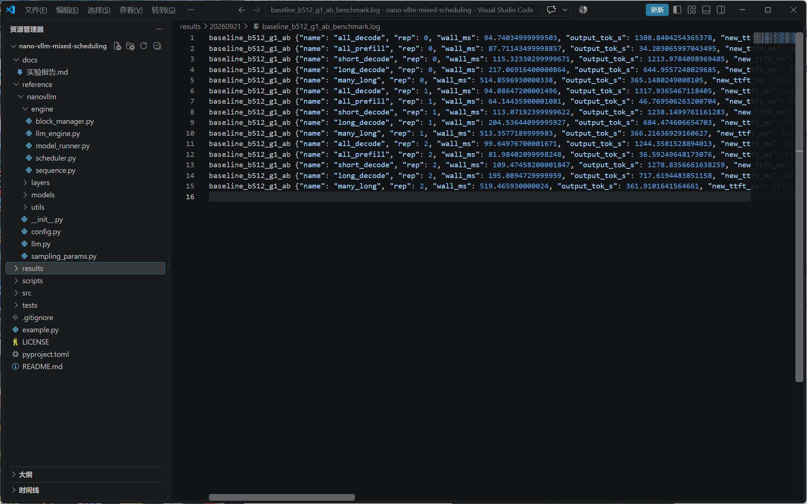
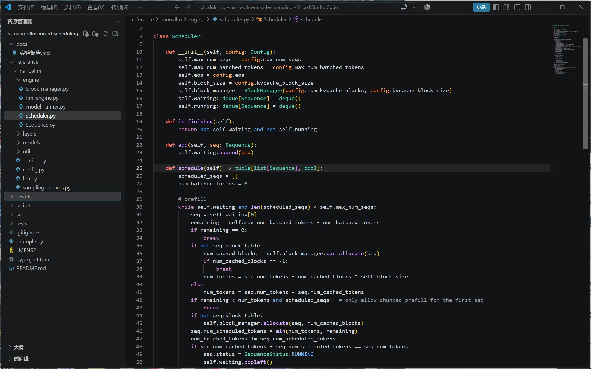
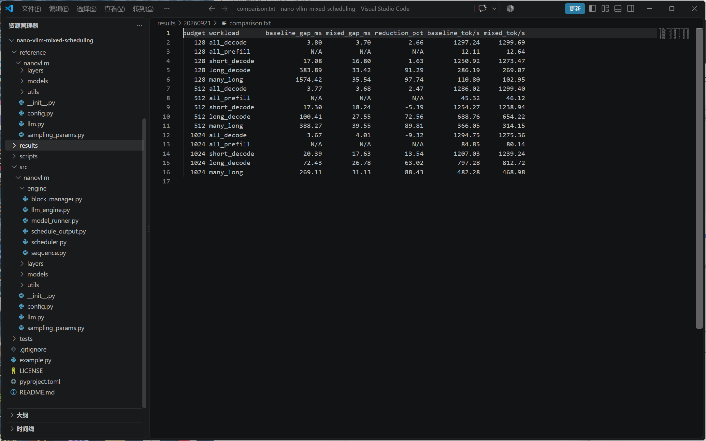

# nano-vLLM 混合调度优化实验

环境：RTX 5080 / Qwen3-0.6B / BF16 / PyTorch 2.11.0+cu128。两组均使用上游算子实现并开启 Decode CUDA Graph，不包含自定义 CUDA 融合扩展。

复测日期：2026-09-21。本次对比上游调度与纯混合调度。现有截图暂留，待替换为本次实验截图；以下文字和表格已更新为最新数据。

## 1. 测试：长 Prompt 加入后，Decode 出现停顿

以 token budget=512 为例，先让 4 条请求进入 Decode，再加入 1 条或 4 条 3000-token Prompt。各进程先预热，采用 A/B、B/A 两种进程顺序，每种顺序测 3 次，取 6 次结果的中位数。完整实验覆盖 128、512、1024 三种预算及五类负载，共 180 条测量。

原调度下，新增 1 条长 Prompt 时，已有 Decode 请求的最大停顿为 **100.41 ms**；新增 4 条时达到 **388.27 ms**。

这里的“最大停顿”按整个 step 返回时刻统计，包含新负载注入后到下一 token 的首次等待，不是平均 TPOT，也不是网络客户端延迟。

## 2. 发现问题：Prefill 连续占用调度轮次

Scheduler 先处理 waiting 中的 Prefill；只要选中了 Prefill，就在第 54–55 行直接返回，本轮不会继续安排 Decode。

**已有 Chunked Prefill 只限制了单次计算量，没有保证每个 chunk 之间让 Decode 执行。** 因此，多个 Prefill chunk 仍可能连续阻塞已有请求。

## 3. 解决问题：先 Decode，再用剩余预算处理 Prefill

修改 Scheduler：先为 running 请求各安排 1 个 Decode token，并预留需要的 KV block；再使用剩余预算选择 FIFO Prefill，最后一个请求允许只执行部分 chunk。

例如：`budget=1024`，3 条 Decode 先占用 3 个 token，Prefill 使用剩余 **1021** 个 token。

新增 `ScheduleOutput` 返回两组请求，Engine 在同一步内先执行 Decode，再执行 Prefill。Decode 保留 CUDA Graph，Prefill 沿用 eager 路径；两组顺序执行。

中间 chunk 只推进 `num_cached_tokens`，不追加生成 token；最后一个 chunk 完成后才进入 running。本次 15 项回归测试全部通过；四组完整模型对照共检查 64 行 logits，top-1 为 64/64 一致，满足预设相对 L2 < 0.03、余弦相似度 > 0.999 的数值容差。

## 4. 复测结果：连续长停顿明显缩短

在相同环境、预算 512 和负载下：

| 已有负载 + 新增负载 | 原调度最大停顿 | 混合调度最大停顿 | 降幅 |
|---|---:|---:|---:|
| 4 条 Decode + 1 条长 Prompt | 100.41 ms | 27.55 ms | **72.56%** |
| 4 条 Decode + 4 条长 Prompt | 388.27 ms | 39.55 ms | **89.81%** |

单长 Prompt 场景中，新方案每次出现 **6 个混合 iteration**，同时保留 **31 次实际 Graph replay**，说明 Prefill 推进期间 Decode 得到了执行机会。

**优化效果：将连续 Prefill 导致的一次长等待，分散到多轮执行中，明显缩短最大停顿。** 代价是单长 Prompt 场景的新请求首 token 延迟从 **95.85 ms 增至 125.94 ms**，输出吞吐从 **688.76 降至 654.22 token/s**；四长 Prompt 场景的吞吐从 **366.05 降至 314.15 token/s**。短输入也并非总有收益：预算 512 时，最大停顿从 17.30 ms 增至 18.24 ms。

